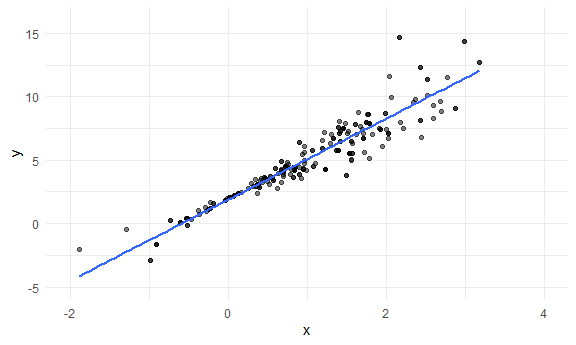
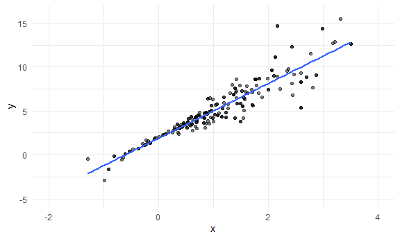
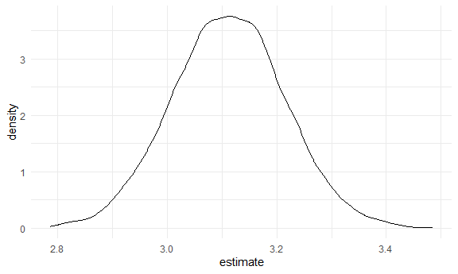
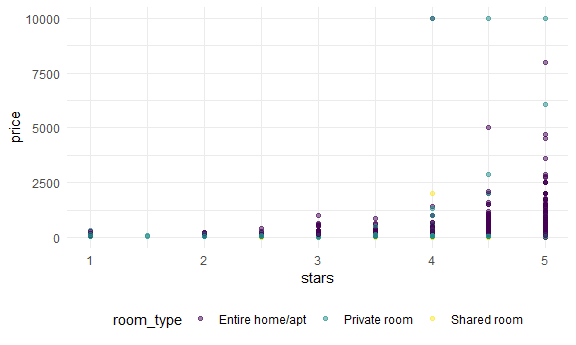
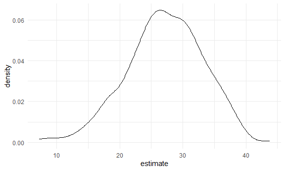

bootstrapping
================
Kino Watanabe
2025-11-28

Load key packages.

``` r
library(tidyverse)
library(p8105.datasets)
library(modelr)
```

Simulate two datasets.

``` r
set.seed(1)

n_samp = 250

sim_df_const = 
  tibble(
    x = rnorm(n_samp, 1, 1),
    error = rnorm(n_samp, 0, 1),
    y = 2 + 3 * x + error
  )

sim_df_nonconst = 
  sim_df_const |> 
  mutate(
    error = .75 * error * x,
    y = 2 + 3 * x + error)
```

By generating data in this way, I’m creating one case in which the usual
linear regression assumptions hold and one case in which they don’t. The
plot below illustrates the differences between the dataset.

Look at these data

``` r
sim_df_nonconst |> 
  ggplot(aes(x = x, y = y)) + 
  geom_point()
```


These datasets have roughly the same overall variance, but the lm shows
data with constant variance and the sim_df_nonconst shows data with
non-constant variance. For this reason, ordinary least squares should
provide reasonable estimates in both cases, but inference is standard
inference approaches may only be justified for the data on in the lm.

What does `lm` do for these?

``` r
sim_df_const |> 
  lm(y ~ x, data = _) |> 
  broom::tidy() |> 
  knitr::kable(digits = 3)
```

| term        | estimate | std.error | statistic | p.value |
|:------------|---------:|----------:|----------:|--------:|
| (Intercept) |    1.977 |     0.098 |    20.157 |       0 |
| x           |    3.045 |     0.070 |    43.537 |       0 |

``` r
sim_df_nonconst |> 
  lm(y ~ x, data = _) |> 
  broom::tidy() |> 
  knitr::kable(digits = 3)
```

| term        | estimate | std.error | statistic | p.value |
|:------------|---------:|----------:|----------:|--------:|
| (Intercept) |    1.934 |     0.105 |    18.456 |       0 |
| x           |    3.112 |     0.075 |    41.661 |       0 |

**when i look at the non-constant variance model, i know that it
violates assumptions of linear models. Heteroskedasticity breaks the
assumptions behind the usual standard errors and confidence intervals in
regression.**

**Bootstrap SE comes from the empirical distribution because it is
computed by repeatedly resampling your actual data, not by relying on
theoretical formulas. The variation across resamples gives the SE.**

Write a function to draw a bootstrap sample.

Let’s write a quick function to generate our bootstrap samples. This
function should have the data frame as the argument, and should return a
sample from that dataframe drawn with replacement.

``` r
boot_sample = function(df) {
  
  sample_frac(df, size = 1, replace = TRUE)
  
}
```

Does this work?

``` r
sim_df_nonconst |> 
  boot_sample() |> 
  ggplot(aes(x = x, y = y)) + 
  geom_point(alpha = 0.5) + 
  geom_smooth(method = "lm", se = FALSE) + 
  xlim(c(-2, 4)) + 
  ylim(c(-5, 16))
```

    ## `geom_smooth()` using formula = 'y ~ x'



So I want to formalize this a bit and extract results.

We’re going to draw repeated samples with replacement, and then analyze
each of those samples separately. It would be really great to have a
data structure that makes it possible to keep track of everything. Maybe
a list column??!

``` r
boot_straps = 
  tibble(
    iter = 1:5000
  ) |> 
  mutate(
    bootstrap_sample = map(iter, \(i) boot_sample(df = sim_df_nonconst))
  )
```

(quick check)

``` r
boot_straps |> 
  pull(bootstrap_sample) |> 
  nth(2) |> 
  ggplot(aes(x = x, y = y)) + 
  geom_point(alpha = 0.5) + 
  geom_smooth(method = "lm", se = FALSE) + 
  xlim(c(-2, 4)) + 
  ylim(c(-5, 16))
```

    ## `geom_smooth()` using formula = 'y ~ x'



Actually run my analyses!

``` r
bootstrap_results = 
  boot_straps |> 
  mutate(
    fits = map(bootstrap_sample, \(df) lm(y ~ x, data = df)),
    results = map(fits, broom::tidy)
  )
```

Look at results.

- I’d like to get a sense of the variability in estimated intercepts and
  slopes across all my bootstrap samples. The code chunk below uses this
  pipeline to look at bootstrap standard errors for the estimated
  regression coefficients.

``` r
bootstrap_results |> 
  select(iter, results) |> 
  unnest(results) |> 
  group_by(term) |> 
  summarize(
    mean = mean(estimate),
    se   = sd(estimate)
  )
```

    ## # A tibble: 2 × 3
    ##   term         mean     se
    ##   <chr>       <dbl>  <dbl>
    ## 1 (Intercept)  1.93 0.0762
    ## 2 x            3.11 0.103

Comparing these to the results of ordinary least squares, the standard
error for the intercept is much smaller and the standard error for the
intercept is a bit larger. This is reasonable, given the non-constant
variance in the data given smaller residuals around zero and larger
residuals in the the tails of the x distribution.

Look at these first

Distribution of estimated slopes

``` r
bootstrap_results |> 
  select(iter, results) |> 
  unnest(results) |> 
  filter(term == "x") |> 
  ggplot(aes(x = estimate)) + 
  geom_density()
```



I can also use the estimates across bootstrap samples to construct a
confidence interval. For a 95% CI, we might try to exclude the lower and
upper 2.5% of the distribution of parameter estimates across “repeated”
samples. The code below will do that.

``` r
bootstrap_results |> 
  select(iter, results) |> 
  unnest(results) |> 
  group_by(term) |> 
  summarize(
    ci_lower = quantile(estimate, 0.025),
    ci_upper = quantile(estimate, 0.975)
  )
```

    ## # A tibble: 2 × 3
    ##   term        ci_lower ci_upper
    ##   <chr>          <dbl>    <dbl>
    ## 1 (Intercept)     1.78     2.09
    ## 2 x               2.91     3.32

## Do it again but faster this time

``` r
bootstrap_results = 
  sim_df_const |> 
  bootstrap(n = 5000) |> 
  mutate(
    df = map(strap, as_tibble),
    fits = map(df, \(df) lm(y ~ x, data = df)),
    results = map(fits, broom::tidy)
  ) |> 
  select(.id, results) |> 
  unnest(results)
```

Look at what this means.

``` r
bootstrap_results |> 
  group_by(term) |> 
  summarize(
    mean = mean(estimate),
    se   = sd(estimate)
  )
```

    ## # A tibble: 2 × 3
    ##   term         mean     se
    ##   <chr>       <dbl>  <dbl>
    ## 1 (Intercept)  1.98 0.0974
    ## 2 x            3.04 0.0707

## Airbnb

Remember this one?

``` r
data("nyc_airbnb")

nyc_airbnb =
  nyc_airbnb |> 
  mutate(stars = review_scores_location / 2) |> 
  rename(
    borough = neighbourhood_group
  ) |> 
  filter(
    borough != "Staten Island"
  ) |> 
  drop_na(price, stars, room_type) |> 
  select(price, stars, room_type, borough)
```

Remind me what this looks like?

``` r
nyc_airbnb |> 
  ggplot(aes(x = stars, y = price, color = room_type)) + 
  geom_point(alpha = .5)
```



- sKewed distribution. lm assumptions violated.

Try to do the bootstrap.

- some large outliers in price might affect estimates and inference for
  the association between star rating and price. Because estimates are
  likely to be sensitive to those outliers and “usual” rules for
  inference may not apply, the code chunk below uses the bootstrap to
  examine the distribution of regression coefficients under repeated
  sampling.

``` r
airbnb_bootstrap_results = 
  nyc_airbnb |> 
  filter(borough == "Manhattan") |> 
  bootstrap(n = 1000) |> 
  mutate(
    df = map(strap, as_tibble),
    fits = map(df, \(df) lm(price ~ stars + room_type, data = df)),
    results = map(fits, broom::tidy)
  ) |> 
  select(.id, results) |> 
  unnest(results)
```

Look at the distribution of the slope for stars.

``` r
airbnb_bootstrap_results |> 
  filter(term == "stars") |> 
  ggplot(aes(x = estimate)) +
  geom_density()
```



- This distribution has a heavy tail extending to low values and a bit
  of a “shoulder”, features that may be related to the frequency with
  which large outliers are included in the bootstrap sample.
